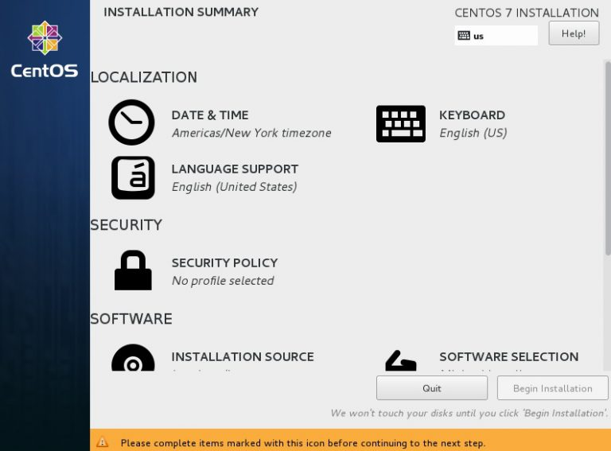

# Installation

<div dir="rtl" markdown="1">

## نصب CentOS
1- در ابتدا باید iso آن را از سایت مربوطه دانلود کرده و آن را با استفاده از روش های موجود، Bootable کنیم تا بتوانیم آن را نصب کنیم.   
2- بعد از بوت کردن ایمیج، از خط فرمان بر روی Install CentOS میزنیم.   
3- در این بخش باید زبان سیستم را انتخاب کنیم که بر روی پیش فرض گذاشته و Continue را میزنیم.   





4- در این مرحله صفحه اصلی نصب را مشاهده میکنید و باید مرحله به مرحله پیش بریم.   
5- اولین چیز گزینه Date & Time است که باید تنظیم شود. بر روی Tehran را انتخاب کرده و گزینه Done را میزنیم.   
6- قسمت دوم Keyboard است که میتوان در صفحه مربوطه بر روی + زد و Persian را اضافه کرد.   
7- قسمت Language Support مربوط به زبان هایی است که سیستم قرار است آن ها را پشتیبانی کند. بهتر است اگر زبان دیگری میخواهیم در همین مرحله اضافه کنیم.   


8- قسمت Installation Source برای استفاده از دیگر منابع نصب از مدیای DVD یا USB محلی مانند FTP است. اما از این روش ها تنها درصورتی استفاده کنید که بدانیم چه کاری میکند. بنابراین همان Auto-detected installation media پیش فرض را انتخاب کرده و برای ادامه روی Done می زنیم.   
9- قسمت Software Selection برای انتخاب موارد مورد نیاز برای نصب است. درصورتی که برای سرور نصب میکنیم بهتر است از گزینه Minimal استفاده کنیم.   
10- در قسمت Installation Destination باید مکان نصب و پارتیشن هارا تنظیم کرد. در صورتی که اطلاع کافی از نحوه پارتیشن بندی Linux نداریم باید بر روی گزینه Automaticly Configure partitioning بزنیم. ولی در صورت اطلاع کافی میتوانیم I will configure partitioning را انتخاب کرده تا به صفحه پارتیشن بندی برویم.   


11- حال باید 4 پارتیشن Boot - Root - Swap - Home را درست کنیم. در اینجا پارتیشن Home اختیاری است. 
<div dir="ltr" markdown="1">

>Boot -> /boot -> not LVM -> 500mb   
>Swap -> /swap -> LVM -> 'Twice RAM'  
>Home -> /home -> LVM -> 'As You Like'   
>Root -> / -> LVM -> 'As You Like'   


<div dir="rtl" markdown="1">
12- حال کار تنظیمات تمام شده است و میتوانیم بر روی Begin Installation بزنیم.   
13- در مرحله نصب باید رمز کاربر Root را به دلخواه وارد کنید.   
<div dir="ltr" markdown="1">

# Commands

<div dir="rtl" markdown="1">
دستورات ترمینال این جلسه :  
<div dir="ltr" markdown="1">

- yum
- openssh


## yum: 
<div dir="rtl" markdown="1">
برای نصب پکیج در centos استفاده میشود.
<div dir="ltr" markdown="1">

```linux
--- yum ---
>

```

## openssh: 
<div dir="rtl" markdown="1">
SSH یا همان OpenSSH یک راه ارتباطی به صورت خط فرمان است.
<div dir="ltr" markdown="1">

```linux
--- sshd ---
[installation] yum -y install openssh-server openssh-client
[enabling] systemctl start sshd
[enabling] systemctl enable sshd
[opening port] firewall-cmd --zone=public --add-port=22/tcp --permanent
[reload firewall] firewall-cmd --reload
```